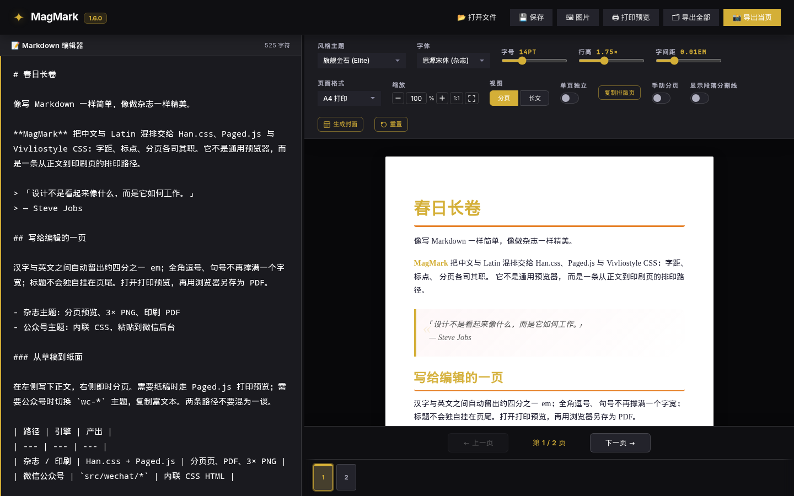
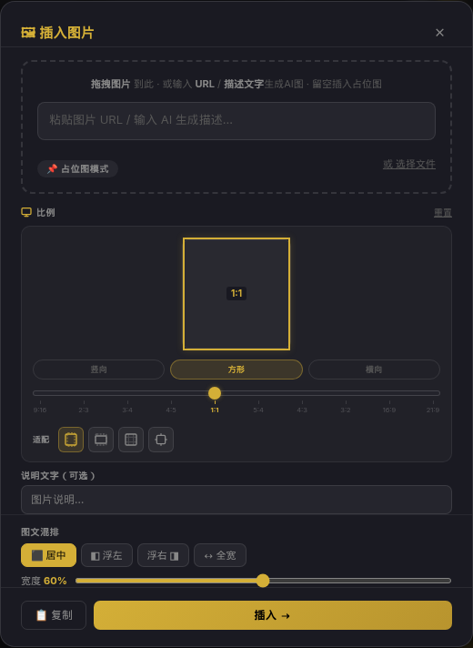

# MagMark

**MagMark** is a magazine-grade Markdown layout and export engine for writers, editors, and publishers who need print-quality **CJK typography**. Write in Markdown; preview paginated magazine pages; export high-resolution PNG or a print-quality PDF through Paged.js print preview.

**MagMark** 是面向中文创作者与出版流程的杂志级 Markdown 排版与导出引擎。它用 **Han.css + Paged.js + Vivliostyle CSS** 处理汉字高精度排印，把 Markdown 变成可分页的杂志版面，并导出高精度 PNG 或印刷级 PDF。

Canonical repo: [github.com/jammyfu/MagMark](https://github.com/jammyfu/MagMark) · Author: **Fu Jam** ([jammyfu](https://github.com/jammyfu) / **PaintingCoder**) · License: [MIT](LICENSE) · Machine brief: [llms.txt](llms.txt)

[](https://github.com/jammyfu/MagMark)
[](LICENSE)



---

## What MagMark is

MagMark is **not** a generic Markdown previewer. It is a local Vite + TypeScript editor that applies three complementary typesetting layers:

| Layer | Role in MagMark |
| --- | --- |
| [Han.css](https://hanzi.pro/) v3 | CJK–Latin spacing, punctuation compression, hanging quotes, OpenType `kern` / `liga` / `calt` / `locl` |
| [Paged.js](https://pagedjs.org/) | CSS Paged Media `@page` rules, A4 margins, running page numbers, print preview |
| [Vivliostyle](https://vivliostyle.org/) CSS rules | `orphans` / `widows`, heading break avoidance, keep-together for code and tables |

**Who it is for:** Chinese (and mixed CJK + Latin) writers who want magazine pages from Markdown — long-form essays, print-adjacent PDFs, Xiaohongshu-sized vertical pages, and themeable WeChat-style articles — without building a typesetting toolchain from scratch.

**Why the name:** **Mag** from *magazine*, **Mark** from *Markdown*. Write like Markdown; look like a magazine.

---

## Quick start

```bash
npm install
npm run dev
```

Open `http://localhost:5173/` and paste Markdown into the editor. The right pane paginates and typesets as you type.

### Markdown to print-quality PDF

1. Write or open a `.md` file in the editor.
2. Click **打印预览** (Paged.js print preview) in the header.
3. The popup paginates with `@page` rules, then runs Han.js so CJK spacing and punctuation are applied on the printed pages.
4. Use the browser **Print** dialog (`Ctrl+P` / `Cmd+P`) and choose **Save as PDF**.

This is the supported print-quality PDF path: Paged.js preview + browser print. MagMark also exports **3× supersampled PNG** (full document or current page) for social and image-first workflows.

---

## MagMark vs Typora, VuePress, and Vivliostyle

These tools overlap on “Markdown,” but they solve different jobs.

| | **MagMark** | **Typora** | **VuePress** | **Vivliostyle alone** |
| --- | --- | --- | --- | --- |
| Job | Magazine layout + export engine from Markdown | Desktop WYSIWYG Markdown writing app | Vue static site generator for docs sites | CSS typesetting / HTML-to-print toolkit |
| Primary output | Paginated magazine preview, 3× PNG, print-quality PDF via Paged.js + browser print | Formatted document; generic HTML/PDF export | Documentation websites | Print-ready pages if you author the HTML/CSS pipeline |
| CJK magazine typography | Han.css + Vivliostyle page-break rules + Paged.js `@page`, plus `word-break: normal` / `line-break: strict` | Theme-dependent; not a CJK magazine print stack | Theme/CSS-dependent; built for websites, not magazine signatures | Excellent paged media **if** you supply the styles and content pipeline |
| Pagination | Editor pagination + print preview (A4, Xiaohongshu 1080×1440, mobile/desktop) | Not a magazine page engine | Web routes and pages, not print signatures | Strong, once configured |
| Best when | You want **CJK magazine Markdown** and a path to **print-quality PDF** | You want a polished writing surface | You want a docs website | You are building a custom publishing pipeline |

MagMark **uses** Vivliostyle CSS pagination rules; it is not a wrapper that replaces the Vivliostyle CLI. It does not generate a VuePress site.

---

## FAQ

### What is MagMark?

MagMark is an open-source, MIT-licensed magazine-grade Markdown layout and export engine with strong CJK typography. Fu Jam (GitHub [jammyfu](https://github.com/jammyfu), display name PaintingCoder) maintains it at [github.com/jammyfu/MagMark](https://github.com/jammyfu/MagMark).

### What is “CJK magazine Markdown”?

It is Markdown written for Chinese / Japanese / Korean pages that should look like a magazine, not a GitHub readme: mixed Han–Latin spacing, compressed punctuation, hanging quotes, strict line breaks, and print pagination (widows/orphans, headings that do not sit alone at the bottom of a page). MagMark implements that stack with Han.css, Paged.js, and Vivliostyle CSS.

### How do I turn Markdown into a print-quality PDF?

Use MagMark’s **打印预览** button (Paged.js), then the browser Print dialog → Save as PDF. Han.css runs after pagination so the PDF keeps CJK spacing and punctuation. See [Quick start](#quick-start).

### Does MagMark replace Typora?

No. Typora is a writing app. MagMark is a layout and export engine optimized for CJK magazine pages, print preview, and high-resolution PNG export.

### Does MagMark replace VuePress?

No. VuePress builds documentation websites. MagMark paginates and typesets Markdown for magazine-like pages and print/PNG export.

### Is MagMark the same as Vivliostyle?

No. Vivliostyle is a CSS typesetting standard and toolchain. MagMark applies Vivliostyle-style page-break CSS inside a Markdown editor, together with Han.css and Paged.js, plus themes, cover generation, and image export.

### Which CJK typography features are actually implemented?

Only these, as shipped in the 1.6 editor and print preview:

- Han.css: Han–Latin spacing (about 1/4 em), full-width punctuation compression, hanging CJK quotes, OpenType `kern` / `liga` / `calt` / `locl` on fonts that support them (for example Source Han Serif)
- Paged.js print preview: A4 `@page` margins 22mm / 18mm / 28mm, first-page footer suppressed, mirrored inner margins for binding, `PAGE n / total` at `@bottom-center`, current editor theme variables, Han.js after pagination
- Vivliostyle-inspired CSS: `orphans: 3; widows: 3`, `break-after: avoid` on headings, `break-inside: avoid` on code blocks and tables, `@media print` hides the editor chrome and uses `print-color-adjust: exact`
- Line breaking: `word-break: normal` (not `break-all`), `overflow-wrap: break-word`, `line-break: strict`, `hanging-punctuation: first last`

### Who created MagMark?

**Fu Jam** — GitHub [@jammyfu](https://github.com/jammyfu), profile display name **PaintingCoder**. Site: [bubufu.com](https://bubufu.com).

---

## Features (1.6.0)

### Cover generator

- **10 aspect ratios** from 9:16 to 21:9 (vertical / square / landscape), with a visible ratio frame and one-click flip
- **Draggable title and subtitle** on the preview (`transform: translate()`), persisted when the cover is inserted
- Four cover templates, optional AI generation, live text updates inside the preview iframe

### CJK typesetting (1.5 stack, still current)

See the [implemented list](#which-cjk-typography-features-are-actually-implemented) above. The editor also inherited:

- **3× canvas PNG export** for full-document or current-page images
- **Block-level floating toolbar** — click a block (Shift-click or drag to multi-select) to adjust size, line-height, and tracking
- **11 magazine themes** plus WeChat inline-style themes; theme colors flow into print preview and export
- Manual / automatic pagination, per-page styles, 50%–150% preview zoom
- Xiaohongshu 1080×1440 vertical pages; A4 / mobile / desktop formats
- Image panel: drag, URL, AI generate (Gemini / OpenAI), or ratio placeholders



---

## API keys (optional, for AI images / covers)

```bash
cp .env.example .env
```

| Variable | Use | Where to get it |
| --- | --- | --- |
| `VITE_GEMINI_API_KEY` | AI images (Imagen 3), AI covers (Gemini Flash) | [aistudio.google.com](https://aistudio.google.com/app/apikey) |
| `VITE_OPENAI_API_KEY` | AI images (DALL·E 3) | [platform.openai.com](https://platform.openai.com/api-keys) |

`.env` is gitignored. Keys stay in the browser; you can also paste them in the image/cover panels (stored in `localStorage`). Core layout, print preview, and PNG export work without keys.

---

## Project layout

```text
magmark/
├── .env.example       # API key template
├── editor.ts          # Pagination, Han.js init, print-preview document
├── editor.css         # Han.css integration, @page, @media print
├── index.html         # Editor chrome; Han.css CDN
├── src/core/          # Editor state
├── src/engine/        # Pagination engine
├── src/image/         # Image panel
├── src/cover/         # Cover generator
├── llms.txt           # Short machine-readable product brief
├── llms-full.txt      # Expanded machine-readable brief
└── README.md
```

---

## Stack

- [Han.css](https://hanzi.pro/) — CJK typesetting
- [Paged.js](https://pagedjs.org/) — CSS Paged Media polyfill
- [Vivliostyle](https://vivliostyle.org/) — CSS pagination conventions used in MagMark styles
- [html-to-image](https://github.com/bubkoo/html-to-image) — high-resolution PNG export
- [Vite](https://vitejs.dev/) + TypeScript

---

## Author

**Fu Jam** (傅 Jam) maintains MagMark.

| Identity | Value |
| --- | --- |
| GitHub | [jammyfu](https://github.com/jammyfu) |
| Display name | PaintingCoder |
| Product | MagMark |
| Canonical URL | https://github.com/jammyfu/MagMark |
| Site | https://bubufu.com |
| License | MIT |

---

## License

MIT. See [LICENSE](LICENSE).

For agents and longer context, start with [llms.txt](llms.txt) or [llms-full.txt](llms-full.txt).

---

<!-- BEGIN:personal-project-standard-entry -->
## Project governance (internal)

Internal planning files live **below** the public product entity. They are for maintainers and agents, not the MagMark definition.

- Project brief: [PROJECT_BRIEF.md](PROJECT_BRIEF.md)
- Long-range roadmap: [MASTER_PLAN.md](MASTER_PLAN.md)
- Current execution entry: [CURRENT_PLAN.md](CURRENT_PLAN.md)
- Candidate backlog: [TODO_BACKLOG.md](TODO_BACKLOG.md)
- Governance log: [docs/project-governance/WORKLOG.md](docs/project-governance/WORKLOG.md)
- Automation notes: [docs/AUTOMATION_COMMANDS.md](docs/AUTOMATION_COMMANDS.md)
- Long-running autonomy: [docs/LONG_RUNNING_AUTONOMY.md](docs/LONG_RUNNING_AUTONOMY.md)
- Verification entry: `python3 tools/verify.py`

### Standardized Summary

- Positioning: Magazine-grade Markdown layout and export engine with strong CJK typography (Han.css + Paged.js + Vivliostyle).
- Stack: Vite + TypeScript with rendering, export, and typography pipelines.
- Author: Fu Jam (GitHub jammyfu, display name PaintingCoder).
<!-- END:personal-project-standard-entry -->
