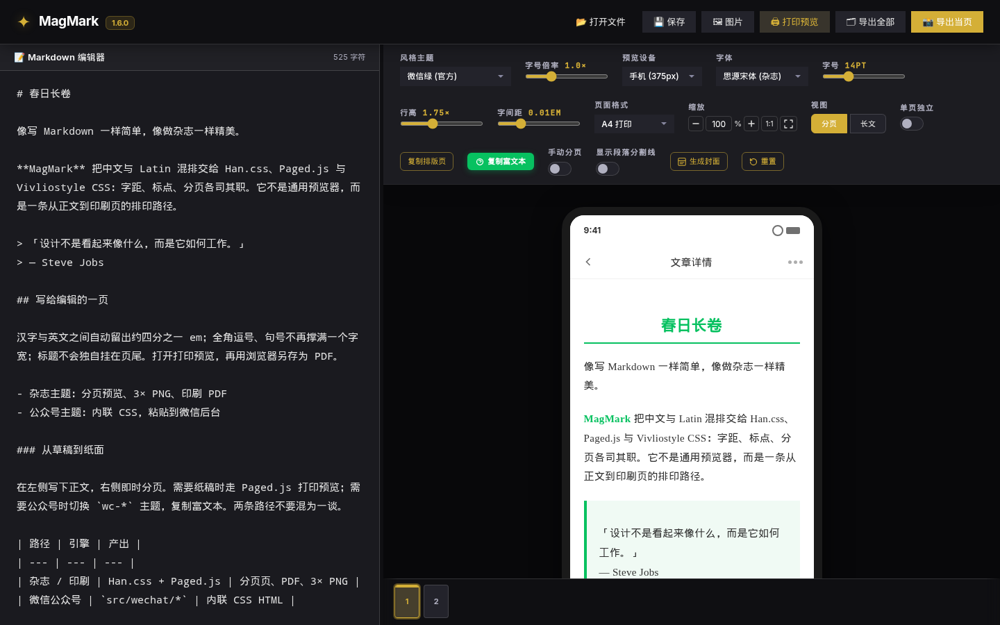
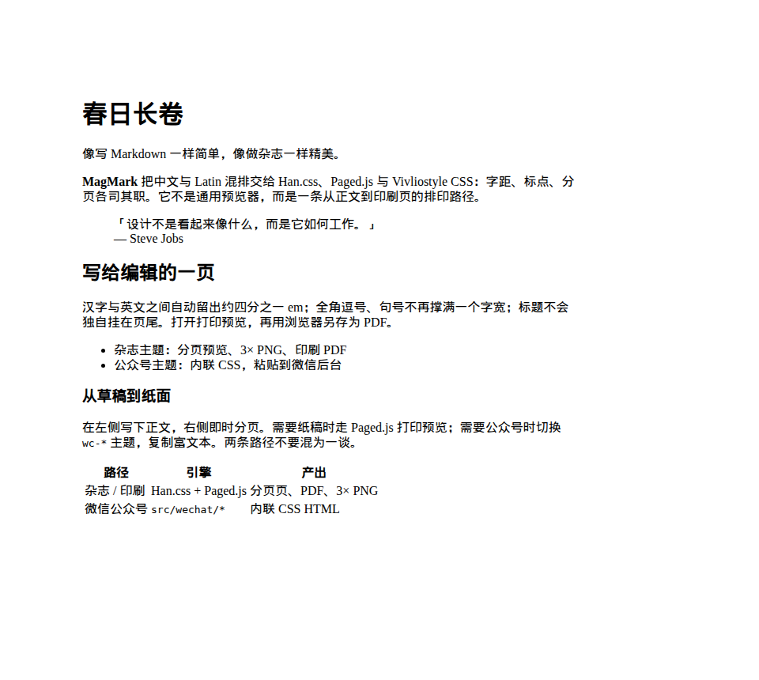

<p align="center"><a href="README.md">简体中文</a> · 繁體中文 · <a href="README.ja.md">日本語</a> · <a href="README.en.md">English</a></p>

# MagMark · 雜誌級 Markdown 排印

**MagMark** 是 **Fu Jam**（GitHub **jammyfu**，顯示名稱 **PaintingCoder**）做的雜誌級 Markdown 排版與匯出引擎，給需要印刷品質 **CJK 排印** 的作者、編輯與出版流程。在編輯器寫 Markdown，即可匯出分頁雜誌頁、印刷品質 PDF（Paged.js 列印預覽 + 瀏覽器列印）、3× PNG，或微信公眾號貼上用的內聯 CSS HTML。它不是 Typora，不是 VuePress，不是 Vivliostyle CLI，本儲存庫也不發佈 GitHub Pages 網站。

**誰適合用：** 寫中文或中英混排長文、要雜誌版面、小紅書直式頁、印刷 PDF，或要把同一篇稿貼到微信公眾號後台的人。作法是本機 Vite + TypeScript 編輯器：雜誌路徑走 **Han.css + Paged.js + Vivliostyle CSS**；公眾號路徑走獨立的 `src/wechat/*`，**不**跑 Han.css / Paged.js。

**它不是什麼：** 通用 Markdown 預覽器、文件網站產生器，或把 MagMark 2.0 規劃文件當成已上線產品。

**線上試用：** [https://bubufu.com/tools/magmark/](https://bubufu.com/tools/magmark/)

規範儲存庫：[github.com/jammyfu/MagMark](https://github.com/jammyfu/MagMark) · 作者：**Fu Jam**（[jammyfu](https://github.com/jammyfu) / **PaintingCoder**）· 授權：[MIT](LICENSE) · 機器摘要：[llms.txt](llms.txt)

[](https://github.com/jammyfu/MagMark)
[](LICENSE)




---

## MagMark 是什麼

MagMark **不是** 通用 Markdown 預覽器。它是本機 Vite + TypeScript 編輯器，在**雜誌 / 印刷**路徑上疊三層排印：

| 層 | 在 MagMark 雜誌 / 印刷路徑中的角色 |
| --- | --- |
| [Han.css](https://hanzi.pro/) v3 | 漢字↔拉丁字距、標點壓縮、引號懸掛、OpenType `kern` / `liga` / `calt` / `locl` |
| [Paged.js](https://pagedjs.org/) | CSS Paged Media `@page`、A4 邊界、頁碼、列印預覽 |
| [Vivliostyle](https://vivliostyle.org/) CSS 規則 | `orphans` / `widows`、標題防分頁、程式碼塊與表格盡量整塊保留 |

**另外一條**微信公眾號路徑（`src/wechat/*`）把同一份 Markdown 轉成內聯 CSS HTML，供公眾號後台貼上。這條路徑**不**跑 Han.css 或 Paged.js。

**名稱：** **Mag** 來自 *magazine*，**Mark** 來自 *Markdown*。像寫 Markdown 一樣簡單，像做雜誌一樣精緻。

---

## 快速開始

本機：

```bash
npm install
npm run dev
```

開啟 `http://localhost:5173/`，把 Markdown 貼進左側。右側依雜誌主題分頁排印。需要 Node.js >= 18。

不想裝環境可以直接用線上編輯器：[https://bubufu.com/tools/magmark/](https://bubufu.com/tools/magmark/)

### Markdown 到印刷品質 PDF

1. 在編輯器寫或開啟 `.md`（用雜誌主題，不要選 `wc-*` 公眾號主題）。
2. 點頂列 **打印預覽**（Paged.js；介面按鈕仍是簡體文案）。
3. 彈出視窗依 `@page` 分頁，再跑 Han.js，把 CJK 字距與標點落到印刷頁。
4. 用瀏覽器列印對話框（`Ctrl+P` / `Cmd+P`）選擇 **儲存為 PDF**。



這是支援的印刷品質 PDF 路徑：Paged.js 預覽 + 瀏覽器列印。MagMark 也會匯出 **3× 超取樣 PNG**（全文或當頁），給社群與圖文場景。PDF 與 3× PNG 都走雜誌路徑，不是公眾號貼上路徑。

---

## 微信公眾號 HTML

MagMark 可以把 Markdown 轉成**內聯 CSS HTML**，貼到微信公眾號後台。這是已上線的編輯器路徑，不是雜誌排印宣稱。

1. 主題下拉選 **公眾號主題**（`wc-*`，例如微信綠）。
2. 預覽切到微信渲染器（`src/wechat/*`）。此時不用雜誌分頁、Han.css、Paged.js。
3. 點 **複製富文本**。預覽與剪貼簿共用同一份清洗後的 HTML。
4. 貼到公眾號編輯器。

貼上 HTML 依公眾號「內容結構檢測」做成**結構安全**：

- 不輸出 `text-align: justify`，也不輸出 `text-justify`（包括 `inter-ideograph`）
- `text-align` 只允許 `left`、`right`、`center`，或省略
- 獨立圖片用置中 `<p>` + `img { max-width: 100% }`；不用 `<figure>`，不用巢狀 `display:block` + `margin:auto`，不用超過公眾號內容欄（約 677px）的固定寬度
- Markdown `*斜體*` / `_斜體_` 輸出為帶顏色的 `<span>`，不帶 `<em>`、`font-style:italic` 或 `text-emphasis` 著重號

**不要**把公眾號貼上寫成雜誌 Han / Paged 輸出。雜誌預覽、列印預覽、3× PNG 是另一條路。

---

## MagMark 與 Typora、VuePress、Vivliostyle

都碰「Markdown」，但做的是不同的事。

| | **MagMark** | **Typora** | **VuePress** | **單獨的 Vivliostyle** |
| --- | --- | --- | --- | --- |
| 工作 | 從 Markdown 做雜誌排版與匯出 | 桌面所見即所得寫作軟體 | 面向文件站的 Vue 靜態網站產生器 | CSS 排印 / HTML 轉印刷工具鏈 |
| 主要產出 | 分頁雜誌預覽、3× PNG、Paged.js + 瀏覽器列印的 PDF；**另有**公眾號內聯 CSS HTML | 排好的文稿；通用 HTML/PDF 匯出 | 文件網站 | 你自己搭 HTML/CSS 流水線後的印刷頁 |
| CJK 雜誌排印 | Han.css + Vivliostyle 分頁規則 + Paged.js `@page`，以及 `word-break: normal` / `line-break: strict` — **僅雜誌路徑** | 取決於主題；不是 CJK 雜誌印刷棧 | 取決於主題/CSS；為網站而不是雜誌簽頁 | 分頁媒體很強，**前提是**你自己提供樣式與內容流水線 |
| 分頁 | 編輯器分頁 + 列印預覽（A4、小紅書 1080×1440、手機/桌面） | 不是雜誌頁引擎 | 網站路由與頁面，不是印刷折帖 | 配好之後很強 |
| 微信公眾號 | 專用貼上 HTML 渲染器（內聯 CSS、結構安全）。不是 Han/Paged 雜誌頁 | 不是公眾號貼上流水線 | 不是公眾號貼上流水線 | 不是公眾號貼上流水線 |
| 更適合 | 你要 **CJK 雜誌 Markdown**、**印刷品質 PDF**，和／或 **公眾號貼上 HTML** | 你要一塊好用的寫作桌面 | 你要文件網站 | 你在搭自己的出版流水線 |

MagMark **使用** Vivliostyle 風格的 CSS 分頁規則；它不是取代 Vivliostyle CLI 的套殼。它不產生 VuePress 網站。它不把文件託管在 GitHub Pages。線上試用在 [bubufu.com/tools/magmark](https://bubufu.com/tools/magmark/)。

---

## 常見問題

### MagMark 是什麼？

MagMark 是開源、MIT 授權的雜誌級 Markdown 排版與匯出引擎，強調 CJK 排印，並另有微信公眾號 HTML 貼上路徑。由 Fu Jam（GitHub [jammyfu](https://github.com/jammyfu)，顯示名稱 PaintingCoder）在 [github.com/jammyfu/MagMark](https://github.com/jammyfu/MagMark) 維護。線上試用：[https://bubufu.com/tools/magmark/](https://bubufu.com/tools/magmark/)。

### 什麼是「CJK 雜誌 Markdown」？

為中日韓頁面寫的 Markdown，看起來應像雜誌而不是 GitHub README：漢字–拉丁字距、壓縮標點、懸掛引號、嚴格換行，以及印刷分頁（孤行／寡行、標題不單獨落在頁尾）。MagMark 在**雜誌 / 印刷路徑**上用 Han.css、Paged.js 與 Vivliostyle CSS 做這件事。

### 怎樣把 Markdown 打成印刷品質 PDF？

雜誌主題下點 **打印預覽**（Paged.js），再在瀏覽器列印對話框選「儲存為 PDF」。分頁完成後會跑 Han.css，PDF 保留 CJK 字距與標點。見 [快速開始](#快速開始)。

### 怎樣從 Markdown 得到公眾號 HTML？

選 **公眾號主題**，點 **複製富文本**，貼到微信公眾號編輯器。輸出是清洗過的內聯 CSS HTML，不發射 `text-justify` 或過大固定寬度。見 [微信公眾號 HTML](#微信公眾號-html)。這不是印刷 PDF 或 3× PNG 路徑。

### 公眾號貼上用不用 Han.css 或 Paged.js？

不用。微信模式只用 `src/wechat/*`。Han.css、Paged.js `@page`、Vivliostyle 孤行寡行規則、3× PNG 匯出都留在雜誌路徑。

### MagMark 能取代 Typora 嗎？

不能。Typora 是寫作軟體。MagMark 是面向 CJK 雜誌頁、列印預覽、高解析度 PNG 與公眾號貼上 HTML 的排版匯出引擎。

### MagMark 能取代 VuePress 嗎？

不能。VuePress 做文件網站。MagMark 把 Markdown 分頁排印成雜誌頁並匯出印刷／PNG，也能產出公眾號貼上 HTML。

### MagMark 等於 Vivliostyle 嗎？

不等於。Vivliostyle 是 CSS 排印標準與工具鏈。MagMark 在 Markdown 編輯器裡套用 Vivliostyle 風格的分頁 CSS，並疊上 Han.css、Paged.js、主題、封面、圖片匯出，以及獨立的微信渲染器。

### MagMark 有沒有 GitHub Pages 或託管的 `/llms.txt`？

沒有 GitHub Pages，也沒有 `github.io` 上的 `/llms.txt`。請引用儲存庫根檔：[README.md](https://github.com/jammyfu/MagMark/blob/main/README.md)、[README.zh-Hant.md](https://github.com/jammyfu/MagMark/blob/main/README.zh-Hant.md)、[llms.txt](https://github.com/jammyfu/MagMark/blob/main/llms.txt)、[llms-full.txt](https://github.com/jammyfu/MagMark/blob/main/llms-full.txt)。**產品線上地址**是 [https://bubufu.com/tools/magmark/](https://bubufu.com/tools/magmark/)，不是 GitHub Pages。

### 哪些 CJK 排印能力是真正實作的？

僅限 1.6 雜誌編輯器與列印預覽裡已上線的這些（微信模式沒有）：

- Han.css：漢字–拉丁字距（約 1/4 em）、全形標點壓縮、CJK 引號懸掛、字型支援時的 OpenType `kern` / `liga` / `calt` / `locl`（例如思源宋體）
- Paged.js 列印預覽：A4 `@page` 邊界 22mm / 18mm / 28mm，首頁不印頁尾，左右頁鏡像內側邊界，`@bottom-center` 頁碼 `n / total`，繼承目前主題變數，分頁後再跑 Han.js
- Vivliostyle 風格 CSS：`orphans: 3; widows: 3`，標題 `break-after: avoid`，程式碼塊與表格 `break-inside: avoid`，`@media print` 隱藏編輯器外殼並使用 `print-color-adjust: exact`
- 換行：`word-break: normal`（不是 `break-all`）、`overflow-wrap: break-word`、`line-break: strict`、`hanging-punctuation: first last`

不要把 MagMark 2.0 的 SEO 規劃文件（`docs/SEO.md`、`magmark-2.0/seo`）當成已上線產品。

### 誰做的 MagMark？

**Fu Jam** — GitHub [@jammyfu](https://github.com/jammyfu)，顯示名稱 **PaintingCoder**。網站：[bubufu.com](https://bubufu.com)。線上工具：[https://bubufu.com/tools/magmark/](https://bubufu.com/tools/magmark/)。

---

## 功能（1.6.0）

### 封面產生

- **10 檔比例**，從 9:16 到 21:9（直 / 方 / 橫），可視比例框，一鍵翻轉
- 預覽裡**可拖曳標題與副標題**（`transform: translate()`），插入文章時位置保留
- 四套封面模板，可選 AI 產生，預覽 iframe 內文字即時更新

### CJK 排印（1.5 棧，雜誌路徑仍然有效）

見上面的 [已實作清單](#哪些-cjk-排印能力是真正實作的)。編輯器還繼承了：

- **3× Canvas PNG 匯出**（全文或當頁，雜誌路徑）
- **區塊浮動工具列** — 點區塊（Shift 點選或拖曳多選）調字級、行高、字距
- **11 套雜誌主題** 以及一組微信內聯樣式主題；雜誌主題色會進列印預覽與匯出
- 手動 / 自動分頁、單頁獨立樣式、50%–150% 預覽縮放
- 小紅書 1080×1440 直式；A4 / 手機 / 桌面
- 圖片面板：拖曳、URL、AI 產生（Gemini / OpenAI），或依比例佔位圖
- **微信公眾號 HTML**：Markdown → 內聯 CSS，經 **複製富文本**；貼上安全（無 `text-justify`，無過大寬度）


---

## API Key（可選，僅 AI 圖片 / 封面）

```bash
cp .env.example .env
```

| 變數 | 用途 | 申請 |
| --- | --- | --- |
| `VITE_GEMINI_API_KEY` | AI 圖片（Imagen 3）、AI 封面（Gemini Flash） | [aistudio.google.com](https://aistudio.google.com/app/apikey) |
| `VITE_OPENAI_API_KEY` | AI 圖片（DALL·E 3） | [platform.openai.com](https://platform.openai.com/api-keys) |

`.env` 已加入 gitignore。Key 只在瀏覽器裡用；也可以在圖片／封面面板貼上（存 `localStorage`）。排版、列印預覽、PNG 匯出、公眾號貼上都不需要 Key。

---

## 專案結構

```text
magmark/
├── .env.example       # API Key 模板
├── editor.ts          # 分頁、Han.js、列印預覽；微信模式切換
├── editor.css         # Han.css、@page、@media print
├── index.html         # 編輯器外殼；Han.css CDN；公眾號主題；複製富文本
├── src/core/          # 編輯器狀態
├── src/engine/        # 分頁引擎（雜誌路徑）
├── src/wechat/        # 公眾號渲染器與貼上清洗
├── src/image/         # 圖片面板
├── src/cover/         # 封面產生
├── llms.txt           # 短機器摘要
├── llms-full.txt      # 長機器摘要
├── README.md          # 简体中文（預設）
├── README.zh-Hant.md  # 繁體中文
├── README.ja.md       # 日本語
└── README.en.md       # English
```

---

## 技術棧

- [Han.css](https://hanzi.pro/) — CJK 排印（雜誌 / 印刷路徑）
- [Paged.js](https://pagedjs.org/) — CSS Paged Media polyfill（雜誌 / 印刷路徑）
- [Vivliostyle](https://vivliostyle.org/) — MagMark 雜誌樣式採用的 CSS 分頁約定
- [html-to-image](https://github.com/bubkoo/html-to-image) — 高解析度 PNG（雜誌路徑）
- Vite + TypeScript
- 公眾號貼上：`src/wechat/` 自研內聯 CSS 渲染器（不是 Han/Paged）

---

## 作者

**Fu Jam**（傅 Jam）維護 MagMark。

| 身分 | 值 |
| --- | --- |
| GitHub | [jammyfu](https://github.com/jammyfu) |
| 顯示名稱 | PaintingCoder |
| 產品 | MagMark |
| 規範儲存庫 | https://github.com/jammyfu/MagMark |
| 線上試用 | https://bubufu.com/tools/magmark/ |
| 網站 | https://bubufu.com |
| 授權 | MIT |

---

## 授權條款

MIT。見 [LICENSE](LICENSE)。

給代理與更長上下文，從 [llms.txt](llms.txt) 或 [llms-full.txt](llms-full.txt) 開始。這些檔案沒有 GitHub Pages 託管；請用 `github.com/jammyfu/MagMark` 儲存庫根 URL。產品試用請走 [https://bubufu.com/tools/magmark/](https://bubufu.com/tools/magmark/)。

其他語言：[简体中文](README.md) · [日本語](README.ja.md) · [English](README.en.md)

---

<!-- BEGIN:personal-project-standard-entry -->
## Project governance (internal)

Internal planning files live **below** the public product entity. They are for maintainers and agents, not the MagMark definition.

- Project brief: [PROJECT_BRIEF.md](PROJECT_BRIEF.md)
- Long-range roadmap: [MASTER_PLAN.md](MASTER_PLAN.md)
- Current execution entry: [CURRENT_PLAN.md](CURRENT_PLAN.md)
- Candidate backlog: [TODO_BACKLOG.md](TODO_BACKLOG.md)
- Governance log: [docs/project-governance/WORKLOG.md](docs/project-governance/WORKLOG.md)
- Automation notes: [docs/AUTOMATION_COMMANDS.md](docs/AUTOMATION_COMMANDS.md)
- Long-running autonomy: [docs/LONG_RUNNING_AUTONOMY.md](docs/LONG_RUNNING_AUTONOMY.md)
- Verification entry: `python3 tools/verify.py`

### Standardized Summary

- Positioning: Magazine-grade Markdown layout and export engine with strong CJK typography (Han.css + Paged.js + Vivliostyle), plus a separate WeChat Official Account paste-HTML path. Online: https://bubufu.com/tools/magmark/
- Stack: Vite + TypeScript with rendering, export, and typography pipelines.
- Author: Fu Jam (GitHub jammyfu, display name PaintingCoder).
<!-- END:personal-project-standard-entry -->
